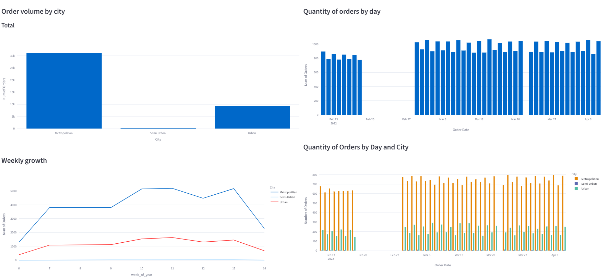
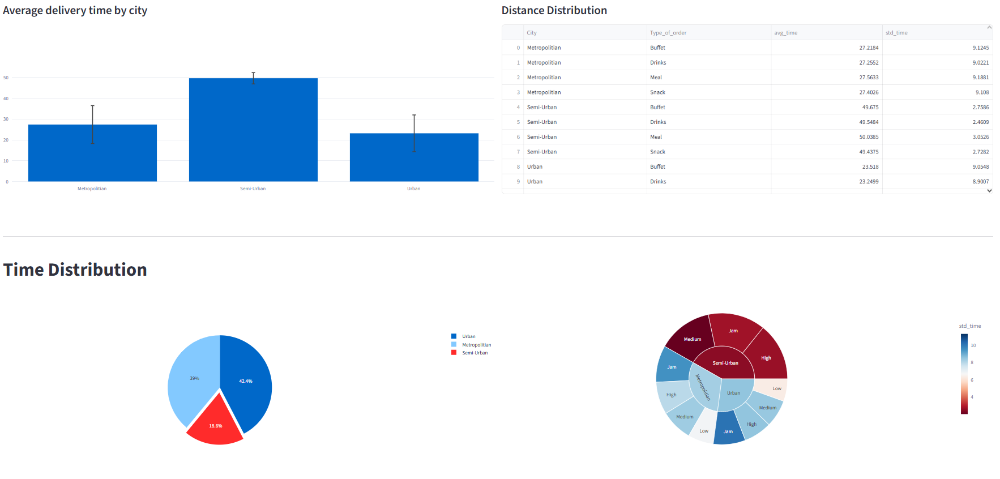

# DeliveryCompany-DS-Problem

## Business Context (The Challenge)
(EN)

A food delivery company is looking to unlock insights from its service data. Your challenge is to take the raw dataset and transform it into a powerful, intuitive dashboard. This tool will be crucial for visualizing performance and guiding the company's strategic decisions.

(PT-BR)

Uma empresa de food delivery busca extrair insights valiosos de seus dados de serviço. Seu desafio é transformar o conjunto de dados brutos em um dashboard poderoso e intuitivo. Esta ferramenta será crucial para visualizar a performance e orientar as decisões estratégicas da empresa.

---





---

##  Overview
(EN)

This project transforms a delivery company's raw data set into an interactive dashboard.
The goal is to provide actionable insights for strategic decision-making, allowing business and operations departments to visualize key metrics clearly and dynamically.

This dashboard was built as a practical demonstration of my end-to-end data project capabilities: from data cleansing and manipulation to creating a functional and intuitive visualization tool.

(PT-BR)

Este projeto transforma um conjunto de dados brutos de uma empresa de delivery em um painel de controle interativo.
O objetivo é fornecer insights acionáveis para a tomada de decisão estratégica, permitindo que as áreas de negócio e operações visualizem métricas chave de forma clara e dinâmica.

Este dashboard foi construído como uma demonstração prática da minha capacidade de ponta a ponta em projetos de dados: desde a limpeza e manipulação dos dados até a criação de uma ferramenta de visualização funcional e intuitiva.

**Dataset: https://www.kaggle.com/datasets/gauravmalik26/food-delivery-dataset?select=train.csv**

---

## Interactive Dashboard

The dashboard is available for online interaction.
Explore the data and filters to discover insights!

** Access the Interactive Dashboard [https://deliverycompany-ds-problem-mwf7wfylhyyjrd8ytuvwdu.streamlit.app/](https://deliverycompany-ds-problem-mwf7wfylhyyjrd8ytuvwdu.streamlit.app/)**

---

## Tools and Technologies

The following tools and libraries were used in the construction of this project:

* **Language:** Python 3.13.2
* **Data Manipulation and Analysis:**
    * **Pandas:** For structuring, cleaning and efficient manipulation of data.
    * **NumPy:** For numerical calculations and optimization of operations on arrays.
* **Visualização de Dados:**
    * **Plotly Express:** For creating interactive and customizable graphics.
    * **Folium:** For generating interactive geographic maps.
* **Dashboard development:**
    * **Streamlit:** For building and rapid prototyping of interactive web dashboard.
* **Geographic Calculations:**
    * **Haversine:** To calculate the geodetic distance between the coordinates of the restaurant and the delivery location.

---

## 🔬 Methodology and Challenges

(EN)

The project followed a clear pipeline to demonstrate the practical application of several key tools:
   1. Data Ingestion and Exploration: The process began with an initial analysis of the dataset to identify key variables and their corresponding data types.
   2. Data Cleaning and Transformation (ETL):
      - Leveraging Pandas, the data was cleaned by handling null values (NaN), casting data types to their appropriate format (e.g., Order_Date to datetime), and trimming extraneous whitespace from string columns.
      - New features were engineered, most notably the calculation of the delivery distance from the restaurant's coordinates.
   4. Dashboard Development with Streamlit:
      - The dashboard's layout was designed with a dedicated sidebar for user controls and a primary content area for displaying metrics and visualizations.
      - Interactive filters were implemented to dynamically update all dashboard elements in real-time, showcasing a core capability of Streamlit.
   6. Visualization Design:
      - A suite of bar charts, line graphs, and interactive maps was developed using Plotly and Folium, powered by dataframes filtered on the fly with Pandas.

**Key Challenge:** A significant challenge was to efficiently compute the haversine distance for every order in the dataset. A naive, row-by-row loop implementation proved to be a performance bottleneck. This was resolved by using the Pandas .apply() method, which vectorized the calculation and led to a dramatic increase in performance.

(PT-BR)

O projeto foi estruturado seguindo um pipeline claro, onde demonstro o uso prático das ferramentas:

1.  **Coleta e Entendimento dos Dados:** Análise inicial do dataset para identificar as variáveis mais relevantes e os tipos de dados.
2.  **Limpeza e Transformação (ETL):**
    * Utilizando **Pandas**, realizei a limpeza dos dados, tratando valores ausentes (`NaN`), convertendo tipos de dados (como `Order_Date` para datetime) e removendo espaços em branco de colunas de texto.
    * Criei novas colunas (feature engineering), como o cálculo da distância entre restaurante e entrega.
3.  **Desenvolvimento do Dashboard com Streamlit:**
    * Estruturei o layout com uma barra lateral para filtros e uma área principal para exibir os gráficos e métricas.
    * Implementei filtros interativos que atualizam dinamicamente todos os componentes do dashboard, uma funcionalidade central do **Streamlit**.
4.  **Criação das Visualizações:**
    * Desenvolvi gráficos de barras, linhas e mapas com **Plotly** e **Folium**, conectando-os aos dataframes filtrados pelo **Pandas**.

**Principal Desafio:** Um dos desafios foi otimizar o cálculo da distância `haversine` em todo o dataset. A aplicação ingênua com um loop seria muito lenta. A solução foi usar o método `.apply()` do **Pandas**, que vetoriza a operação e melhora drasticamente a performance.

### 1. Cleaning the data

  The first stage of this project was to understand what data was inside the dataset, its types, how could be transformed and cleaned.
  For example, it was noticed how some columns were obj and should be strings or ints, floats..
  Also some columns, had empty spaces at the end of theirs fields, like the "Road_traffic_density" column.

  The cleaning of data then was sattled like the following:

  ```python
  # importando banco de dados  - dataframe
df = pd.read_csv('../train.csv')

df1 = df.copy()


# limepza do banco de dados - dataframe

# limpando as linhas
cols = df1.columns
cols_list = cols.tolist()
for c in cols_list:
    rows = (df1[c] != 'NaN ')
    df1 = df1.loc[rows, :].copy()

# removendo o espaço no final da string
cols_to_strip = ['Type_of_vehicle', 'Festival', 'Road_traffic_density', 'Type_of_order','Time_taken(min)']

for c in cols_to_strip:
    df1[c] = df1[c].str.rstrip()

df1['Time_taken(min)'] = df1['Time_taken(min)'].str.strip('(min)')

# alterando os tipos
cols_to_int = ['Delivery_person_Age', 'multiple_deliveries','Time_taken(min)']
cols_to_float = ['Delivery_person_Ratings']
cols_to_datetime = ['Order_Date']

for c in cols_to_int:
    df1[c] = df1[c].astype(int)

for c in cols_to_float:
    df1[c] = df1[c].astype(float)

for c in cols_to_datetime:
    df1[c] = pd.to_datetime(df1[c], format='%d-%m-%Y')
  ```

### 2. Understand what the company wants to see and other views

### 3. What can be seen with this dataset

### 4. The Dashboard

### Conclusion

---
## How to run the project

1. Clone the repository:
```bash
git clone [https://github.com/Stuepp/DeliveryCompany-DS-Problem.git](https://github.com/Stuepp/DeliveryCompany-DS-Problem.git)
cd DeliveryCompany-DS-Problem
```
2. (Optional but recommended)
    1. Create a virtual env - `python -m venv /caminho/para/novo/ambiente/virtual` | `python -m venv /path/to/new/virtual/environment`
    2. Run virtual env - `venv_name/Scripts/Activate.ps1` | `activate.fish` | `activate.bat` | `activate`
3. Install requirements - `pip install -r requirements.txt`
4. Run the code (the dashboard) - `streamlit run projeto.py`
---
# 👨‍💻 Stuepp

LinkedIn: [https://www.linkedin.com/in/arthur-henrique-cavalcanti/](https://www.linkedin.com/in/arthur-henrique-cavalcanti/)

GitHub: [https://github.com/Stuepp](https://github.com/Stuepp)
